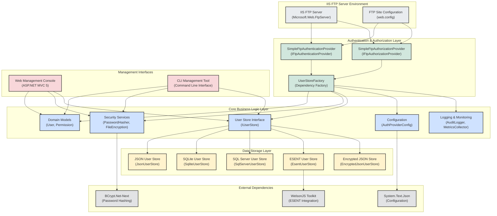
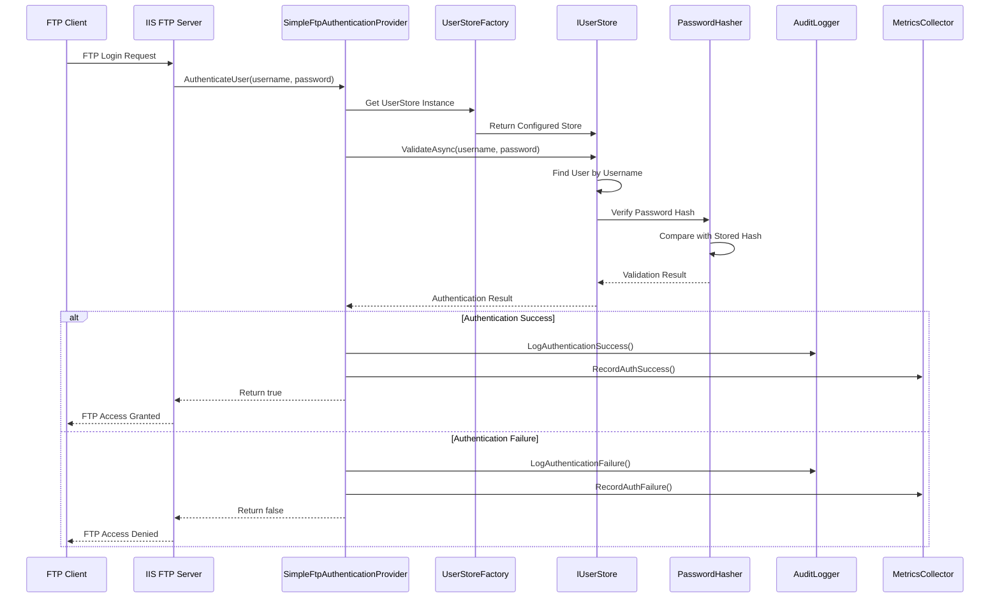
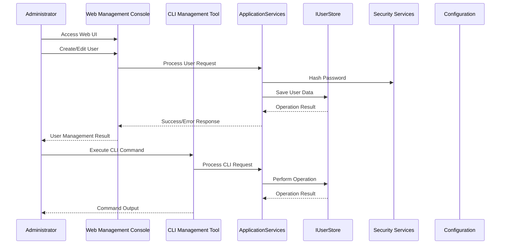
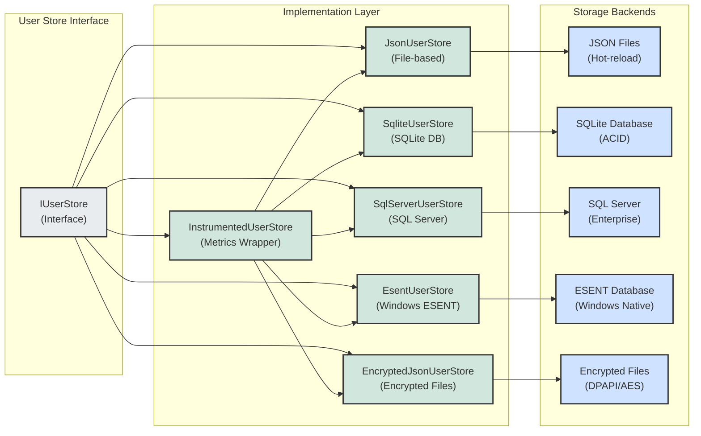
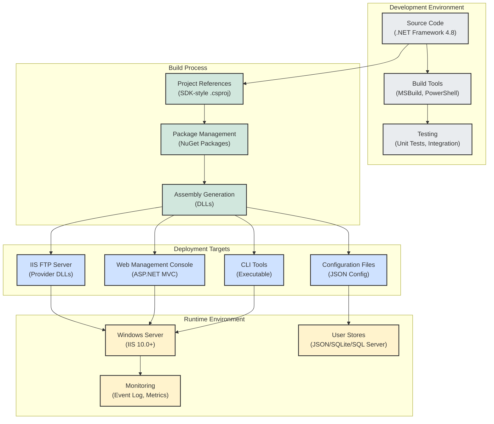

# Architecture Diagrams

## System Overview

```mermaid
graph TD
    subgraph "IIS FTP Server Environment"
        A["IIS FTP Server<br/>(Microsoft.Web.FtpServer)"]
        B["FTP Site Configuration<br/>(web.config)"]
    end
    
    subgraph "Authentication & Authorization Layer"
        C["SimpleFtpAuthenticationProvider<br/>(IFtpAuthenticationProvider)"]
        D["SimpleFtpAuthorizationProvider<br/>(IFtpAuthorizationProvider)"]
        E["UserStoreFactory<br/>(Dependency Factory)"]
    end
    
    subgraph "Core Business Logic Layer"
        F["Domain Models<br/>(User, Permission)"]
        G["Security Services<br/>(PasswordHasher, FileEncryption)"]
        H["User Store Interface<br/>(IUserStore)"]
        I["Configuration<br/>(AuthProviderConfig)"]
        J["Logging & Monitoring<br/>(AuditLogger, MetricsCollector)"]
    end
    
    subgraph "Data Storage Layer"
        K["JSON User Store<br/>(JsonUserStore)"]
        L["SQLite User Store<br/>(SqliteUserStore)"]
        M["SQL Server User Store<br/>(SqlServerUserStore)"]
        N["ESENT User Store<br/>(EsentUserStore)"]
        O["Encrypted JSON Store<br/>(EncryptedJsonUserStore)"]
    end
    
    subgraph "Management Interfaces"
        P["Web Management Console<br/>(ASP.NET MVC 5)"]
        Q["CLI Management Tool<br/>(Command Line Interface)"]
    end
    
    subgraph "External Dependencies"
        R["WelsonJS Toolkit<br/>(ESENT Integration)"]
        S["BCrypt.Net-Next<br/>(Password Hashing)"]
        T["System.Text.Json<br/>(Configuration)"]
    end

    %% Connections
    A --> C
    A --> D
    B --> C
    B --> D
    
    C --> E
    D --> E
    E --> F
    E --> G
    E --> H
    E --> I
    E --> J
    
    H --> K
    H --> L
    H --> M
    H --> N
    H --> O
    
    P --> F
    P --> G
    P --> H
    Q --> F
    Q --> G
    Q --> H
    
    N --> R
    G --> S
    I --> T

    %% Styling
    classDef iisLayer fill:#e9ecef,stroke:#333,stroke-width:2px
    classDef authLayer fill:#d1e7dd,stroke:#333,stroke-width:2px
    classDef coreLayer fill:#cfe2ff,stroke:#333,stroke-width:2px
    classDef dataLayer fill:#fff3cd,stroke:#333,stroke-width:2px
    classDef mgmtLayer fill:#f8d7da,stroke:#333,stroke-width:2px
    classDef depsLayer fill:#e2e3e5,stroke:#333,stroke-width:2px
    
    class A,B iisLayer
    class C,D,E authLayer
    class F,G,H,I,J coreLayer
    class K,L,M,N,O dataLayer
    class P,Q mgmtLayer
    class R,S,T depsLayer
```

## Authentication Flow

```mermaid
sequenceDiagram
    participant Client as FTP Client
    participant IIS as IIS FTP Server
    participant Auth as SimpleFtpAuthenticationProvider
    participant Factory as UserStoreFactory
    participant Store as IUserStore
    participant Hasher as PasswordHasher
    participant Logger as AuditLogger
    participant Metrics as MetricsCollector

    Client->>IIS: FTP Login Request
    IIS->>Auth: AuthenticateUser(username, password)
    Auth->>Factory: Get UserStore Instance
    Factory->>Store: Return Configured Store
    Auth->>Store: ValidateAsync(username, password)
    Store->>Store: Find User by Username
    Store->>Hasher: Verify Password Hash
    Hasher->>Hasher: Compare with Stored Hash
    Hasher-->>Store: Validation Result
    Store-->>Auth: Authentication Result
    
    alt Authentication Success
        Auth->>Logger: LogAuthenticationSuccess()
        Auth->>Metrics: RecordAuthSuccess()
        Auth-->>IIS: Return true
        IIS-->>Client: FTP Access Granted
    else Authentication Failure
        Auth->>Logger: LogAuthenticationFailure()
        Auth->>Metrics: RecordAuthFailure()
        Auth-->>IIS: Return false
        IIS-->>Client: FTP Access Denied
    end
```

## User Management Flow

```mermaid
sequenceDiagram
    participant Admin as Administrator
    participant Web as Web Management Console
    participant CLI as CLI Management Tool
    participant Services as ApplicationServices
    participant Store as IUserStore
    participant Security as Security Services
    participant Config as Configuration

    Admin->>Web: Access Web UI
    Admin->>Web: Create/Edit User
    Web->>Services: Process User Request
    Services->>Security: Hash Password
    Services->>Store: Save User Data
    Store-->>Services: Operation Result
    Services-->>Web: Success/Error Response
    Web-->>Admin: User Management Result

    Admin->>CLI: Execute CLI Command
    CLI->>Services: Process CLI Request
    Services->>Store: Perform Operation
    Store-->>Services: Operation Result
    CLI-->>Admin: Command Output
```

## Data Storage Architecture

```mermaid
graph LR
    subgraph "User Store Interface"
        A["IUserStore<br/>(Interface)"]
    end
    
    subgraph "Implementation Layer"
        B["JsonUserStore<br/>(File-based)"]
        C["SqliteUserStore<br/>(SQLite DB)"]
        D["SqlServerUserStore<br/>(SQL Server)"]
        E["EsentUserStore<br/>(Windows ESENT)"]
        F["EncryptedJsonUserStore<br/>(Encrypted Files)"]
        G["InstrumentedUserStore<br/>(Metrics Wrapper)"]
    end
    
    subgraph "Storage Backends"
        H["JSON Files<br/>(Hot-reload)"]
        I["SQLite Database<br/>(ACID)"]
        J["SQL Server<br/>(Enterprise)"]
        K["ESENT Database<br/>(Windows Native)"]
        L["Encrypted Files<br/>(DPAPI/AES)"]
    end

    A --> B
    A --> C
    A --> D
    A --> E
    A --> F
    A --> G
    
    B --> H
    C --> I
    D --> J
    E --> K
    F --> L
    G --> B
    G --> C
    G --> D
    G --> E
    G --> F

    classDef interface fill:#e9ecef,stroke:#333,stroke-width:2px
    classDef impl fill:#d1e7dd,stroke:#333,stroke-width:2px
    classDef storage fill:#cfe2ff,stroke:#333,stroke-width:2px
    
    class A interface
    class B,C,D,E,F,G impl
    class H,I,J,K,L storage
```

## Security Architecture

```mermaid
graph TD
    subgraph "Password Security"
        A["Password Input<br/>(Plain Text)"]
        B["Salt Generation<br/>(Random Bytes)"]
        C["Hash Algorithm<br/>(BCrypt/PBKDF2/Argon2)"]
        D["Stored Hash<br/>(Base64 Encoded)"]
    end
    
    subgraph "Encryption at Rest"
        E["User Data<br/>(JSON/DB)"]
        F["Encryption Key<br/>(Environment Variable)"]
        G["Encryption Algorithm<br/>(DPAPI/AES-GCM)"]
        H["Encrypted Storage<br/>(Protected Data)"]
    end
    
    subgraph "Access Control"
        I["User Authentication<br/>(Username/Password)"]
        J["Permission Check<br/>(Path-based)"]
        K["Authorization<br/>(Read/Write Rights)"]
        L["Audit Logging<br/>(Event Log/File)"]
    end

    A --> B
    B --> C
    C --> D
    
    E --> F
    F --> G
    G --> H
    
    I --> J
    J --> K
    K --> L

    classDef input fill:#e9ecef,stroke:#333,stroke-width:2px
    classDef process fill:#d1e7dd,stroke:#333,stroke-width:2px
    classDef output fill:#cfe2ff,stroke:#333,stroke-width:2px
    classDef security fill:#fff3cd,stroke:#333,stroke-width:2px
    
    class A,E,I input
    class B,C,F,G,J,K process
    class D,H,L output
    class C,G security
```

## Deployment Architecture

```mermaid
graph TD
    subgraph "Development Environment"
        A["Source Code<br/>(.NET Framework 4.8)"]
        B["Build Tools<br/>(MSBuild, PowerShell)"]
        C["Testing<br/>(Unit Tests, Integration)"]
    end
    
    subgraph "Build Process"
        D["Project References<br/>(SDK-style .csproj)"]
        E["Package Management<br/>(NuGet Packages)"]
        F["Assembly Generation<br/>(DLLs)"]
    end
    
    subgraph "Deployment Targets"
        G["IIS FTP Server<br/>(Provider DLLs)"]
        H["Web Management Console<br/>(ASP.NET MVC)"]
        I["CLI Tools<br/>(Executable)"]
        J["Configuration Files<br/>(JSON Config)"]
    end
    
    subgraph "Runtime Environment"
        K["Windows Server<br/>(IIS 10.0+)"]
        L["User Stores<br/>(JSON/SQLite/SQL Server)"]
        M["Monitoring<br/>(Event Log, Metrics)"]
    end

    A --> B
    B --> C
    A --> D
    D --> E
    E --> F
    
    F --> G
    F --> H
    F --> I
    F --> J
    
    G --> K
    H --> K
    I --> K
    J --> L
    K --> M

    classDef dev fill:#e9ecef,stroke:#333,stroke-width:2px
    classDef build fill:#d1e7dd,stroke:#333,stroke-width:2px
    classDef deploy fill:#cfe2ff,stroke:#333,stroke-width:2px
    classDef runtime fill:#fff3cd,stroke:#333,stroke-width:2px
    
    class A,B,C dev
    class D,E,F build
    class G,H,I,J deploy
    class K,L,M runtime
```